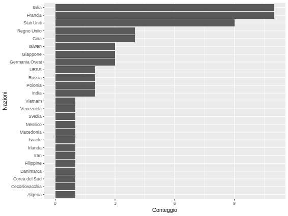

# Estrarre i Leoni d'oro da Wikipedia a riga di comando

## requisiti

- [htmltable2flatgrid](https://github.com/aborruso/htmltable2flatgrid)
- [miller](https://github.com/johnkerl/miller);
- [Rio](https://github.com/jeroenjanssens/data-science-at-the-command-line/blob/master/tools/Rio).

## Script bash

```bash
# estrai la terza tabella dalla pagina di wikipedia
htmltable2flatgrid.py "https://it.wikipedia.org/wiki/Leone_d%27oro_al_miglior_film" 2


# estrai soltanto i record con il premio assegnato, ovvero quelli con il nome del regista valorizzato
# fa il fill-down per la colonna anno
# "normalizza" il separatore degli anni con più nazioni vincitrici, da "/ " a "|"

tail -n +2 ./table.csv | \
mlr --csv filter -S '$Regista =~ ".+"' \
then fill-down -f Anno \
then put '$Nazione=gsub($Nazione,"/ +","|")' >./leoni.csv

# cancella la cartella raw di download
rm ./table.csv

# estrai la colonna Nazione
# separa in verticale le celle con con più nazioni premiate
# conteggia per valori distinti di Nazione
# ordina per Nazione
mlr --csv cut -o -f Nazione \
then nest --explode --values --across-records -f Nazione --nested-fs "|" \
then count-distinct -f Nazione -o Conteggio \
then sort -nr Conteggio leoni.csv >./leoniNazione.csv

# crea l'istogramma
<./leoniNazione.csv Rio -ge 'g+geom_col(aes(x = reorder(Nazione, Conteggio), y = Conteggio)) + coord_flip() + labs(x = "Nazioni")' > ./leoniNazione.png
```

## output tabellare

| nazione | conteggio |
| --- | --- |
| Francia | 11 |
| Italia | 11 |
| Stati Uniti | 9 |
| Regno Unito | 4 |
| Cina | 4 |
| Giappone | 3 |
| Germania Ovest | 3 |
| Taiwan | 3 |
| India | 2 |
| URSS | 2 |
| Polonia | 2 |
| Russia | 2 |
| Cecoslovacchia | 1 |
| Danimarca | 1 |
| Algeria | 1 |
| Macedonia | 1 |
| Vietnam | 1 |
| Iran | 1 |
| Irlanda | 1 |
| Israele | 1 |
| Corea del Sud | 1 |
| Svezia | 1 |
| Venezuela | 1 |
| Filippine | 1 |
| Messico | 1 |

## output grafico

